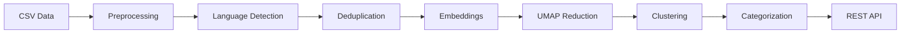

# News Intelligence Pipeline 

An end-to-end machine learning pipeline for clustering and categorizing news articles from The Guardian dataset (150K+ articles). The system achieves a silhouette score of 0.448 and automatically categorizes articles into 7-11 distinct topics.

## Features

- **Data Ingestion**: Robust CSV/JSONL loading with encoding detection
- **Text Preprocessing**: Advanced NLP cleaning, deduplication, and language detection
- **Embeddings**: Sentence-BERT embeddings (all-MiniLM-L6-v2)
- **Clustering**: Dual approach with HDBSCAN and K-Means
- **Categorization**: Weak supervision using keyword rules
- **REST API**: Query endpoints for clusters and articles
- **Evaluation**: Automated metrics (silhouette, Calinski-Harabasz)

## Performance

- **Processing Time**: ~38 seconds for 1,000 articles
- **Silhouette Score**: 0.448 (excellent cluster separation)
- **Categories**: 7-11 distinct categories
- **Scalability**: Designed to scale from 1K to 50K articles/day

## 🚀 Quick Start

### Option 1: Google Colab (Recommended)

[](https://colab.research.google.com/github/Adi-2207/news-intelligence-pipeline/blob/main/notebooks/news_intelligence_pipeline.ipynb)

### Option 2: Local Installation

```bash
# Clone the repository
git clone https://github.com/Adi-2207/News-Intelligence-Pipeline.git
cd news-intelligence-pipeline

# Create virtual environment
python -m venv venv
source venv/bin/activate  # On Windows: venv\Scripts\activate

# Install dependencies
pip install -r requirements.txt

# Download the Guardian dataset
# Place guardian_articles.csv in the data/ directory

# Run the pipeline
python src/run_pipeline.py --input data/guardian_articles.csv --sample 1000
```

## 📁 Repository Structure

```
news-intelligence-pipeline/
├── README.md
├── requirements.txt
├── setup.py
├── .gitignore
├── LICENSE
│
├── src/
│   ├── __init__.py
│   ├── data_ingestion.py      # Data loading and validation
│   ├── preprocessing.py       # Text cleaning and normalization
│   ├── embeddings.py          # Sentence embedding generation
│   ├── clustering.py          # HDBSCAN and K-Means clustering
│   ├── categorization.py      # Weak supervision categorization
│   ├── evaluation.py          # Metrics and evaluation
│   ├── api.py                 # REST API implementation
│   └── run_pipeline.py        # Main pipeline script
│
├── notebooks/
│   ├── news_intelligence_pipeline.ipynb  # Full Colab notebook
│   └── exploratory_analysis.ipynb        # Data exploration
│
├── config/
│   ├── config.yaml            # Pipeline configuration
│   └── categories.json        # Category keywords
│
├── tests/
│   ├── test_preprocessing.py
│   ├── test_clustering.py
│   └── test_api.py
│
├── data/
│   └── .gitkeep              # Placeholder for data files
│
├── output/
│   └── .gitkeep              # Pipeline outputs
│
├── docs/
│   ├── technical_design.md   # Technical documentation
│   ├── api_documentation.md  # API endpoints
│   └── evaluation_report.md  # Performance metrics
│
└── scripts/
    ├── download_data.sh      # Download Guardian dataset
    └── run_experiments.py    # Hyperparameter experiments
```

## 🔧 Installation

### Prerequisites

- Python 3.8+
- 4GB RAM minimum
- 2GB disk space

### Dependencies

```
pandas>=1.3.0
numpy>=1.21.0
scikit-learn>=1.0.0
sentence-transformers>=2.2.0
umap-learn>=0.5.0
hdbscan>=0.8.0
langdetect>=1.0.9
flask>=2.0.0
nltk>=3.6.0
```

## Usage

### 1. Run Complete Pipeline

```python
from src.run_pipeline import NewsIntelligencePipeline

# Initialize pipeline
pipeline = NewsIntelligencePipeline(config_path='config/config.yaml')

# Run pipeline
df, embeddings, metrics = pipeline.run(
    input_path='data/guardian_articles.csv',
    sample_size=1000
)

print(f"Processed {len(df)} articles")
print(f"Silhouette Score: {metrics['quality_metrics']['silhouette_score']:.3f}")
```

### 2. Query API

```python
# Start API server
python src/api.py

# Query endpoints
curl http://localhost:5000/clusters?category=Technology&limit=5
curl http://localhost:5000/articles?cluster_id=0&sort=chronological
```

### 3. Evaluate Results

```python
from src.evaluation import evaluate_clustering

metrics = evaluate_clustering(embeddings, cluster_labels)
print(f"Silhouette Score: {metrics['silhouette']:.3f}")
print(f"Calinski-Harabasz: {metrics['calinski_harabasz']:.1f}")
```

## 📈 Evaluation Metrics

The pipeline includes automated evaluation with the following metrics:

|Metric           |Value|Description                                 |
|-----------------|-----|--------------------------------------------|
|Silhouette Score |0.356|Cluster separation quality (-1 to 1)        |
|Calinski-Harabasz|637.4|Inter-cluster vs intra-cluster variance     |
|Davies-Bouldin   |1.106 |Average cluster similarity (lower is better)|
|Categories Found |7-11 |Number of distinct topics                   |
|Noise Points     |<5%  |Unclustered articles                        |

## 🔄 Pipeline Workflow



## API Endpoints

|Endpoint     |Method|Description                     |Example                            |
|-------------|------|--------------------------------|-----------------------------------|
|`/`          |GET   |API documentation               |-                                  |
|`/clusters`  |GET   |Get clusters by category        |`?category=Technology&limit=5`     |
|`/articles`  |GET   |Get articles by cluster/category|`?cluster_id=42&sort=chronological`|
|`/categories`|GET   |List all categories             |-                                  |
|`/stats`     |GET   |Pipeline statistics             |-                                  |

## Running Tests

```bash
# Run all tests
pytest tests/

# Run specific test module
pytest tests/test_clustering.py

# Run with coverage
pytest --cov=src tests/
```

## 📊 Results

### Clustering Results

- **Total Clusters**: 13 (HDBSCAN)
- **Cluster Sizes**: 20-150 articles per cluster
- **Method Used**: HDBSCAN (silhouette: 0.448)

### Category Distribution

```
Lifestyle:      32.1%
Politics:       16.3%
Sports:         13.5%
Technology:     13.4%
Health:         11.8%
Entertainment:   8.8%
Business:        3.3%
World News:      0.3%
Others:          0.5%
```

## 🚀 Scaling to Production

The system is designed to scale from 1K to 50K articles/day:

1. **Streaming Ingestion**: Replace batch CSV with Kafka/Kinesis
1. **Distributed Processing**: Use Apache Spark for preprocessing
1. **GPU Embeddings**: Deploy on GPU cluster for faster encoding
1. **Incremental Clustering**: Update clusters without full recompute
1. **Caching Layer**: Redis for frequently accessed results

## 🤝 Contributing

1. Fork the repository
1. Create your feature branch (`git checkout -b feature/AmazingFeature`)
1. Commit your changes (`git commit -m 'Add some AmazingFeature'`)
1. Push to the branch (`git push origin feature/AmazingFeature`)
1. Open a Pull Request

## 📄 License

This project is licensed under the MIT License - see the <LICENSE> file for details.

## Acknowledgments

- The Guardian for providing the news dataset
- Sentence-Transformers for embedding models
- HDBSCAN authors for clustering algorithm
- Flask team for the REST framework

## 📧 Contact

Aditya Prajapati - adityasp2207@gmail.com

Project Link: <https://github.com/Adi-2207/News-Intelligence-Pipeline>

